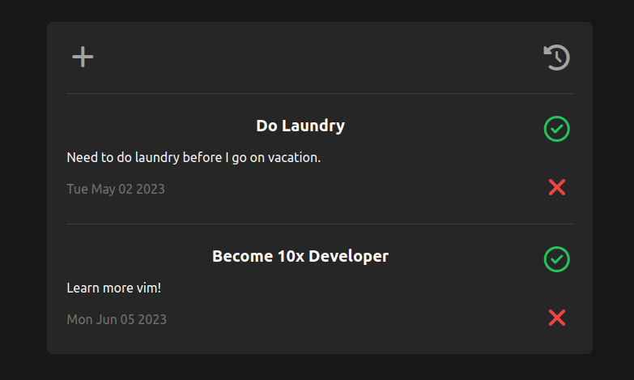

# MyPlanner

A simple planner app for reminders and todos. Add a reminder by pressing the plus button. Fill in the fields and submit to save the reminder to your list. The home page has your full reminder list sorted by due date. To complete a task hit the checkmark. Delete a task by clicking the X. Past reminders can be seen by clicking the history icon.

MyPlanner is built with SvelteKit and Tailwind. Backend services and database are managed by the open source BaaS Supabase. MyPlanner does not have authentication.
